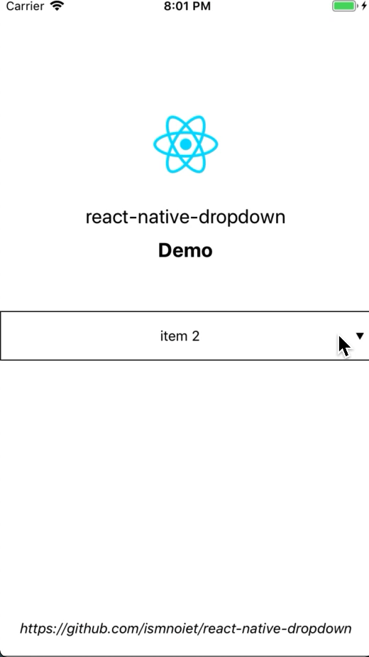

<h2 align="center">React Native Dropdown Menu</h2>
<p align="center">The high-quality native iOS dropdown menu</a> for <a href="https://facebook.github.io/react-native/">react native.</a> A component that offers a veriety of options...

<p align="center">
  <a href="https://github.com/ismnoiet/example_RN_dropdown" style="margin-bottom: 10px"><b>Demo</b></a>
</p>
<p align="center">
  
</p>

## Getting Started

1. Installation

   * Using npm: `npm install --save @ismnoiet/react-native-dropdown`
   * Using yarn: `yarn add @ismnoiet/react-native-dropdown`

2. Link
   * Run `react-native link @ismnoiet/react-native-dropdown`
   * If linking fails, follow the
     [manual linking steps](https://facebook.github.io/react-native/docs/linking-libraries-ios.html#manual-linking)

## Usage

If you want a working example you can check this [simple example](https://github.com/ismnoiet/example_RN_dropdown), otherwise you can use the following example as a starting point.

```javascript
import DropDownMenu from '@ismnoiet/react-native-dropdown'
```

```JSX
<View style={{flex: 1, flexDirection: 'row'}}>
  <DropDownMenu
    style={{ height: 50, justifyContent: 'center', width: 300 }}
    data={['option1', 'option2', 'option3']}
    onChange={ (data)=>{ console.log(data);} }
    selectedRowBackgroundColor="#f4f7f9"
    selectedRowTextSize={20}
    titleBackgroundColor="#d93a47"
    selectedItemColor="#4caf50"
    highlightBackgroundColor="#e91e63"
    titleColor="#fff"
    tintColor="#e9e31e"
  />
</View>
```
## API

| Property |      Description      |  Type  |
|----------|:-------------:|----------|
| data | an array containing dropdown menu data  | Array |
| onChange |  a callback to be executed once the selected item changes   |   Function |
| selectedRowBackgroundColor |  background color for the currently selected row   |   String(**must be a hex value**) |
| selectedRowTextSize |  text size for the currently selected row   |   Number(by default 16) |
| titleBackgroundColor |  background color for the title   |   String(**must be a hex value**) |
| selectedItemColor |  selected item color   |   String(**must be a hex value**) |
| highlightBackgroundColor |  background color for the row that has been highlighted   |   String(**must be a hex value**) |
| titleColor |  color of the title   |   String(**must be a hex value**) |
| tintColor |  color of the arrow icon   |   String(**must be a hex value**) |


## Todo
   - [ ] Add android support(coming soon!)
   - [ ] Impliment other necessary methods.
   - [ ] Improve the documentation.
   - [ ] Make the module cooler.


## Acknowledgement

   * <a href="https://github.com/maxkonovalov/MKDropdownMenu">MKDropdownMenu</a>, which this module is based on.

## How to contribute ?
You are interested and want to contribute? Awesome, just consider the following steps:

1. Fork this repository.
2. Add and test the fixes/improvements you worked on to a seperate branch.
3. Submit your pull request(PR).